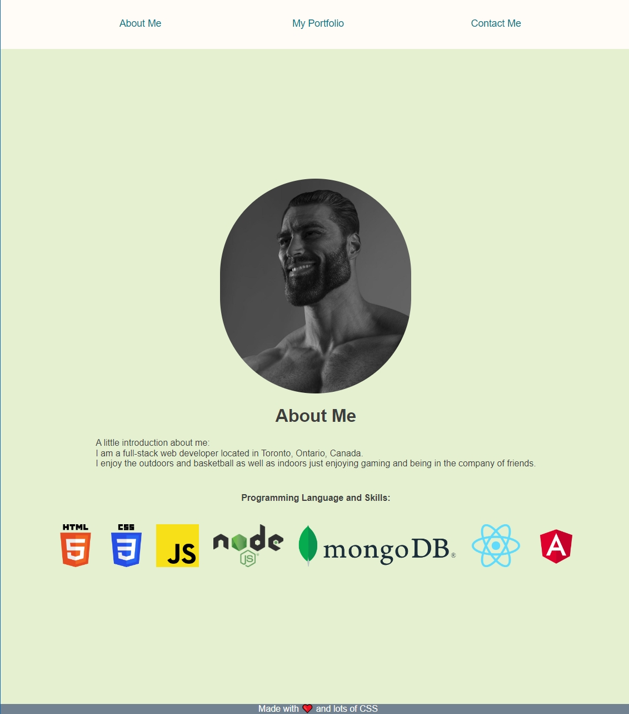
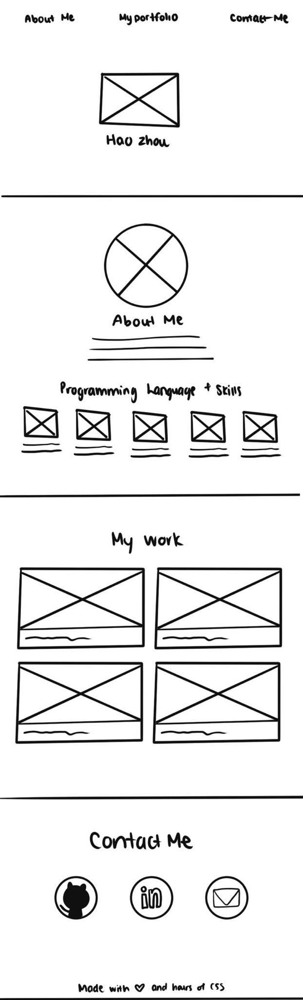

# 02 Advanced CSS: Portfolio

## This is an example portfolio project made with HTML and pure CSS.



## Installation

N/A

## Usage

```
Navigate using the top navbar.
Try out different screen size to see it's repsoniveness.
Is mobile friendly.
```

## Contributing

Hao Zhou and friends

## Extra

### Wireframe screenshot:



## License

[MIT](https://choosealicense.com/licenses/mit/)
